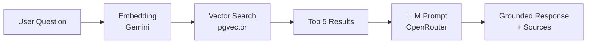

# IronMind AI

> **AI Fitness Coach — Trained on 6 Years of Real Experience**

🔗 **Live demo:** [iron-mind-psi.vercel.app](https://iron-mind-psi.vercel.app)

IronMind is a retrieval-augmented (RAG) fitness coach that answers **only** from a curated knowledge base of evidence-based training, nutrition, recovery, and mindset principles. Every question is embedded, matched against stored principles via vector similarity search, and answered by an LLM constrained to that retrieved context — so it cites its sources and, when the knowledge base doesn't cover a topic, it says so instead of hallucinating. The result is a coach that speaks from real, verifiable experience rather than generic internet advice.

---

## Tech Stack

| Layer | Technology |
| --- | --- |
| Framework | Next.js 16 (App Router) |
| UI | React 19, Tailwind CSS 4, Framer Motion |
| Language | TypeScript |
| Database | PostgreSQL + [pgvector](https://github.com/pgvector/pgvector) |
| ORM | Prisma 7 |
| Embeddings | Google Gemini API (`gemini-embedding-001`, 768-dim) |
| Generation | OpenRouter (LLM chat completions) |
| Hosting | Supabase (database), Vercel (app) |

---

## Features

- 🧠 **RAG-powered chat** — answers grounded in a curated knowledge base
- 🔍 **Vector similarity search** — semantic retrieval with pgvector cosine distance
- 🚫 **Zero-hallucination design** — declines to answer when the knowledge base doesn't cover a topic
- 📎 **Source citations** — every answer shows the exact principles it drew from
- 🔐 **JWT authentication** — protected admin routes
- 🛠️ **Admin knowledge management** — add and delete principles with auto-generated embeddings
- 💪 **Before/after transformation showcase** — the story behind the coach
- 📱 **Responsive design** — polished on mobile and desktop
- ✨ **Smooth animations** — Framer Motion + Lenis smooth scrolling

---

## Architecture

The RAG pipeline turns a plain-language question into a grounded, cited answer:



1. The question is embedded into a 768-dimension vector via the Gemini API.
2. pgvector performs a cosine-similarity search against every stored principle.
3. The five most relevant principles are retrieved with their similarity scores.
4. Those principles are injected as context into a tightly-scoped LLM prompt (OpenRouter).
5. The model returns an answer constrained to that context, plus the sources it used.

---

## How It Works

| Step | What happens |
| --- | --- |
| **1. Ask** | You type a fitness question in plain language. |
| **2. Search** | IronMind embeds the question and finds the most relevant stored principles by meaning. |
| **3. Answer** | It returns a grounded response with the exact sources it used — or admits when it has no view on the topic. |

---

## Getting Started

### Prerequisites

- Node.js 20+
- A PostgreSQL database with the `pgvector` extension (e.g. [Supabase](https://supabase.com))
- API keys for [Google Gemini](https://ai.google.dev) and [OpenRouter](https://openrouter.ai)

### Setup

```bash
# 1. Clone the repo
git clone https://github.com/SumerThakur1771/IronMind.git
cd IronMind

# 2. Install dependencies (also generates the Prisma client)
npm install

# 3. Configure environment variables
cp .env.example .env   # then fill in the values (see below)

# 4. Apply database migrations (creates tables + enables pgvector)
npx prisma migrate deploy

# 5. Start the dev server
npm run dev
```

Open [http://localhost:3000](http://localhost:3000) to view the app.

### Environment Variables

| Variable | Description |
| --- | --- |
| `DATABASE_URL` | PostgreSQL connection string (use the Supabase **pooler** URL for serverless) |
| `GEMINI_API_KEY` | Google Gemini API key — used to generate embeddings |
| `OPENROUTER_API_KEY` | OpenRouter API key — used to generate chat responses |
| `JWT_SECRET` | Secret used to sign and verify authentication tokens |

---

## Project Structure

```
ironmind/
├── app/
│   ├── api/
│   │   ├── auth/            # login & register endpoints (JWT)
│   │   ├── chat/            # RAG chat endpoint
│   │   └── knowledge/       # CRUD for knowledge entries (+ embeddings)
│   ├── components/          # KnowledgeCard, KnowledgeForm, SmoothScroll
│   ├── lib/
│   │   ├── ai.ts            # Gemini embeddings + OpenRouter generation
│   │   ├── prisma.ts        # Prisma client (serverless-safe)
│   │   └── rag.ts           # vector similarity search
│   ├── admin/               # knowledge management (protected)
│   ├── chat/                # chat interface
│   ├── login/ · register/   # auth pages
│   └── page.tsx             # landing page
├── prisma/
│   ├── schema.prisma        # Knowledge, Embedding, User models
│   └── migrations/          # includes pgvector setup
├── docs/                    # deployment & build notes
└── middleware.ts            # route protection
```

---

## Built By

**Sumer Thakur** — MS in Information Systems, Northeastern University
[github.com/SumerThakur1771](https://github.com/SumerThakur1771)
